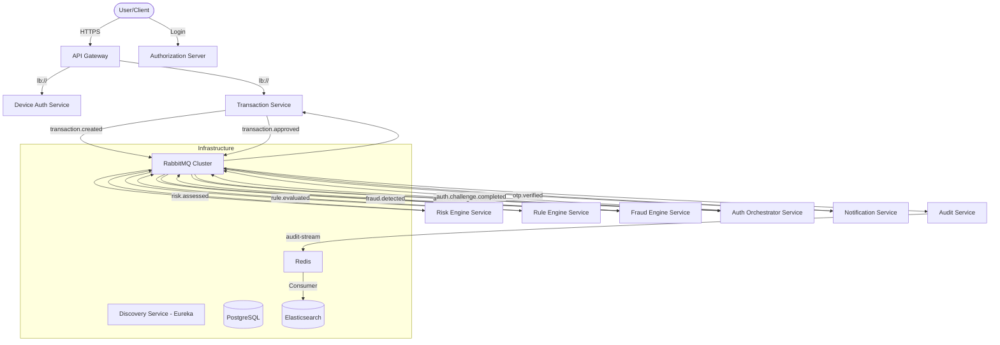

# PROJECT_CONTEXT: SecurePay360

This document serves as the **Single Source of Truth** for the SecurePay360 microservices platform. It is designed to provide complete context for AI assistants to understand, troubleshoot, and extend the system.

---

## 1. Project Overview
*   **Name:** SecurePay360
*   **Domain:** Fintech / Banking-Grade Fraud Detection and Transaction Processing.
*   **Business Objective:** Secure real-time transaction processing by analyzing risk, evaluating fraud rules, and enforcing multi-factor authentication (MFA) when suspicious patterns are detected.
*   **Technology Stack:**
    *   **Java Version:** 21 (Eclipse Temurin)
    *   **Framework:** Spring Boot 3.4.3
    *   **Cloud Architecture:** Spring Cloud (Netflix Eureka, Gateway, LoadBalancer)
    *   **Messaging:** RabbitMQ (Topic Exchange)
    *   **Persistence:** PostgreSQL 16
    *   **Caching/Streaming:** Redis 7.4 (Caching, Aggregation Context, Streams)
    *   **Search/Audit:** Elasticsearch 8.15 & Kibana
    *   **Security:** OAuth2 Authorization Server, JWT (RSA Signed), API Gateway Resource Server
    *   **Containerization:** Docker & Docker Compose (Multi-stage builds)

---

## 2. High-Level Architecture

---

## 3. Repository Structure

| Project | Purpose | Key Responsibilities |
| :--- | :--- | :--- |
| `discovery-service` | Eureka Server | Service registry and discovery. |
| `authorization-server` | OAuth2 Server | User auth, JWT issuance (RSA), user management. |
| `api-gateway` | Edge Gateway | Routing, JWT validation, Correlation ID injection, Claim propagation. |
| `transaction-service` | Core Ledger | Transaction creation, Status management (PENDING -> APPROVED/BLOCK). |
| `device-auth-service`| Device Security | Fingerprinting, Device trust management, Risk scoring per device. |
| `risk-engine-service` | Math Risk | Calculates risk based on amount and device history. |
| `rule-engine-service` | Rule Evaluator | Dynamic SpEL rules (e.g., HIGH_AMOUNT, UNTRUSTED_DEVICE). |
| `fraud-engine-service`| Aggregator | Waits for Risk + Rule events in Redis to make a final Fraud Score decision. |
| `auth-orchestrator-service`| MFA Logic | Transitions fraud decisions into authentication challenges. |
| `notification-service` | MFA Delivery | OTP generation, Redis caching of OTPs, SMS/Email delivery (simulated). |
| `audit-service` | Persistence | Consumes all events, buffers in Redis Streams, indexes to Elasticsearch. |

---

## 4. End-to-End Request Flow

### Step 1: Login & Token Acquisition
*   Client calls `POST /oauth2/token` on `api-gateway` (forwarded to `authorization-server`).
*   Receives JWT containing `sub`, `customerId`, `roles`.

### Step 2: Transaction Initiation
*   Client calls `POST /api/v1/transactions` via Gateway.
*   `api-gateway` validates JWT, injects `X-Correlation-Id`, extracts `customerId` to header.
*   `transaction-service` saves record as `PENDING`, publishes `transaction.created`.

### Step 3: Analysis Pipeline
*   `risk-engine-service` calculates score, publishes `risk.assessed`.
*   `rule-engine-service` evaluates dynamic SpEL rules, publishes `rule.evaluated`.
*   `fraud-engine-service` consumes both. Once both scores are in Redis (`fraud:{txnId}`), it publishes `fraud.detected`.

### Step 4: Step-Up Authentication (MFA)
*   `auth-orchestrator-service` sees `STEP_UP_AUTH` decision, creates `auth_sessions`, publishes `auth.challenge.created`.
*   `notification-service` generates OTP, saves to Redis (`otp:{txnId}`), logs OTP to console.

### Step 5: Verification & Completion
*   Client calls `POST /api/v1/otp/verify` with OTP.
*   `notification-service` validates against Redis, publishes `otp.verified`.
*   `auth-orchestrator-service` updates session to `VERIFIED`, publishes `auth.challenge.completed`.
*   `transaction-service` updates transaction to `APPROVED`, publishes `transaction.approved`.

### Step 6: Auditing
*   `audit-service` intercepts every event, pushes to `audit-stream` (Redis).
*   `AuditStreamConsumer` reads from Redis and indexes into Elasticsearch.

---

## 5. Infrastructure Documentation

### RabbitMQ (Exchange: `securepay.exchange`, Type: `topic`)
| Routing Key | Producer | Consumers |
| :--- | :--- | :--- |
| `transaction.created` | Transaction | Risk Engine |
| `risk.assessed` | Risk Engine | Rule Engine, Fraud Engine, Audit |
| `rule.evaluated` | Rule Engine | Fraud Engine, Audit |
| `fraud.detected` | Fraud Engine | Auth Orchestrator, Audit |
| `auth.challenge.created`| Auth Orchestrator | Notification, Audit |
| `otp.verified` | Notification | Auth Orchestrator |
| `auth.challenge.completed`| Auth Orchestrator | Transaction, Audit |
| `transaction.approved` | Transaction | Audit |

### Redis Key Schema
*   `fraud:{transactionId}`: Hash (riskScore, ruleScore, customerId, matchedRules). Expire: 10m.
*   `session:{transactionId}`: String (AuthType). Expire: 10m.
*   `otp:{transactionId}`: String (OTP value). Expire: 10m.
*   `device:{customerId}`: Cached risk score.
*   `audit-stream`: Redis Stream for audit buffering.

### Database (PostgreSQL)
*   `users`: Auth Server (id, username, password, roles, customer_id).
*   `transactions`: Transaction Service (id, amount, status, customer_id, created_at).
*   `fraud_rules`: Rule Engine (id, rule_name, rule_expression, risk_score, enabled).
*   `fraud_decisions`: Fraud Engine (id, transaction_id, fraud_score, decision).
*   `auth_sessions`: Auth Orchestrator (id, transaction_id, status, auth_type).

---

## 6. Security & Observability

### Security
*   **Gateway:** `SecurityWebFilterChain` rejects any request to `/api/v1/**` without a valid Bearer token.
*   **Auth Server:** RSA Key Pair rotated on restart (in current dev mode).
*   **Propagation:** `JwtPropagationFilter` in Gateway maps JWT claims to `X-User-Id`, `X-Username`, `X-Customer-Id`.

### Observability
*   **Correlation ID:** Generated in `CorrelationIdFilter`, logged by all services in SLF4J patterns.
*   **Audit Trail:** Elasticsearch index `securepay-audit-yyyy.MM`.
*   **Health:** `/actuator/health` exposed for Docker healthchecks.

---

## 7. AI Context (Single Source of Truth)

> **IMPORTANT:** When answering questions or generating code for SecurePay360, adhere to these architectural rules:
>
> 1. **Networking:** In Docker, use `lb://SERVICE-NAME`. Never hardcode `localhost`.
> 2. **State:** Analysis results are aggregated in **Redis** by `fraud-engine-service`. It waits for BOTH `risk` and `rule` keys to be present before finalizing.
> 3. **Events:** Every significant state change MUST publish a RabbitMQ event to `securepay.exchange`.
> 4. **Audit:** Do not write directly to DB for logging. Use `AuditWriter` which triggers the Redis Stream -> Elasticsearch pipeline.
> 5. **Security:** Downstream services trust `X-Customer-Id` headers provided by the Gateway.
> 6. **Transaction Status:** Lifecycle is `PENDING` -> (`APPROVED` or `BLOCK`). OTP verification is the trigger for `APPROVED`.

---

## 8. Current Implementation Status

| Feature | Status | Notes |
| :--- | :--- | :--- |
| Service Discovery | ✅ Implemented | Eureka integrated. |
| API Gateway | ✅ Implemented | Reactive, JWT validated, Routing active. |
| OAuth2 Auth Server | ✅ Implemented | RSA-JWT, User storage in DB. |
| Fraud Pipeline | ✅ Implemented | Risk -> Rule -> Fraud Aggregation. |
| MFA Workflow | ✅ Implemented | OTP generation, Verification, and Status update. |
| End-to-End Audit | ✅ Implemented | RMQ -> Redis Stream -> Elasticsearch. |
| Dockerization | ✅ Implemented | All services + Infra in Docker Compose. |
| Retry / DLQ | ❌ Missing | Needs RabbitMQ failure handling. |
| Circuit Breakers | ❌ Missing | Resilience4j not yet integrated. |
| Shared DTO Library | ❌ Missing | Event DTOs are currently duplicated across modules. |

---

## 9. Project Glossary
*   **Fraud Score:** Final aggregate (Risk + Rule) used to decide `APPROVE`, `STEP_UP_AUTH`, or `BLOCK`.
*   **Ready Check:** Fraud Engine logic verifying all required data is in Redis before processing.
*   **StripPrefix:** Gateway filter removed in latest version because Controllers already include the full path mapping.
*   **JWKS:** JSON Web Key Set - used by Gateway to fetch public keys from the Auth Server for token validation.
