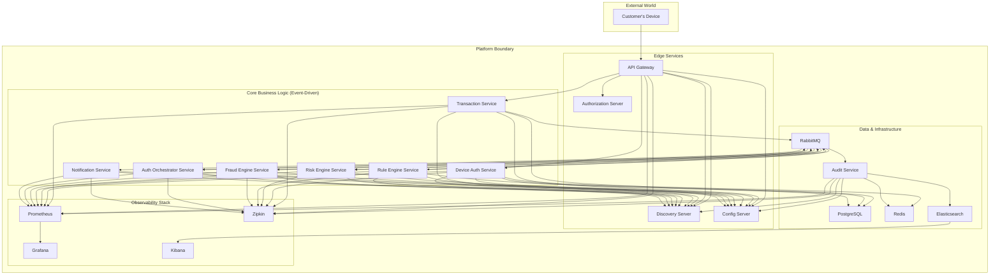
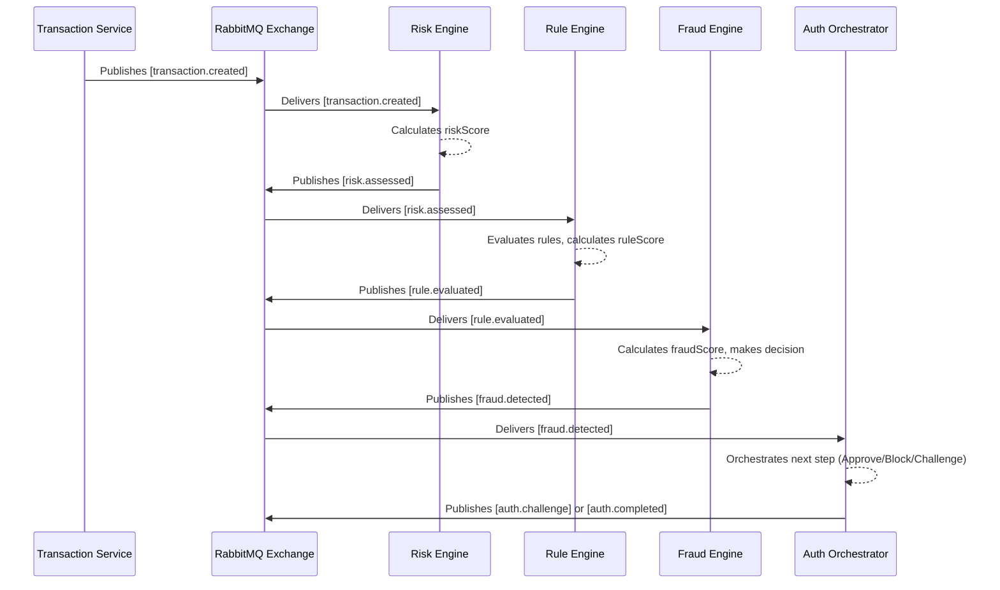
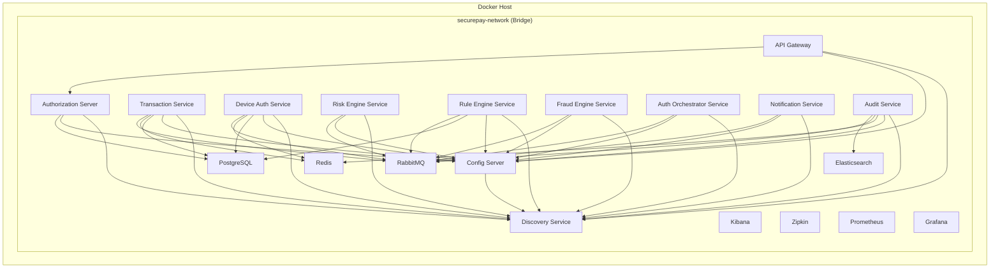

# SecurePay 360: Enterprise Authentication & Fraud Detection Platform

---

**Document Version:** 1.0  
**Status:** Production POC - Complete  
**Contact:** Principal Architecture Team

---

## Table of Contents

1.  [Project Overview](#1-project-overview)
    *   [What is SecurePay 360?](#what-is-securepay-360)
    *   [Business Objectives](#business-objectives)
    *   [Target Use Cases](#target-use-cases)
2.  [End-to-End Business Flow](#2-end-to-end-business-flow)
    *   [Transaction Journey](#transaction-journey)
3.  [System Architecture](#3-system-architecture)
    *   [Component Diagram](#component-diagram)
    *   [Microservice Communication](#microservice-communication)
    *   [Event-Driven Flow (Sequence Diagram)](#event-driven-flow-sequence-diagram)
    *   [Deployment View](#deployment-view)
    *   [Observability Architecture](#observability-architecture)
4.  [Core Concepts & Flows](#4-core-concepts--flows)
    *   [Authentication & Authorization Flow](#authentication--authorization-flow)
    *   [Device Verification Flow](#device-verification-flow)
    *   [Fraud Detection Flow](#fraud-detection-flow)
5.  [Microservice Deep Dive](#5-microservice-deep-dive)
    *   [Discovery Service](#discovery-service)
    *   [Config Server](#config-server)
    *   [Authorization Server](#authorization-server)
    *   [API Gateway](#api-gateway)
    *   [Device Auth Service](#device-auth-service)
    *   [Transaction Service](#transaction-service)
    *   [Risk Engine Service](#risk-engine-service)
    *   [Rule Engine Service](#rule-engine-service)
    *   [Fraud Engine Service](#fraud-engine-service)
    *   [Auth Orchestrator Service](#auth-orchestrator-service)
    *   [Notification Service](#notification-service)
    *   [Audit Service](#audit-service)
6.  [Platform Infrastructure](#6-platform-infrastructure)
    *   [RabbitMQ: Messaging Backbone](#rabbitmq-messaging-backbone)
    *   [Redis: Caching & Streaming](#redis-caching--streaming)
    *   [PostgreSQL: Relational Data](#postgresql-relational-data)
    *   [Elasticsearch & Kibana: Auditing & Analytics](#elasticsearch--kibana-auditing--analytics)
7.  [API Reference](#7-api-reference)
    *   [Authentication API](#authentication-api)
    *   [Transaction API](#transaction-api)
8.  [Example Scenarios](#8-example-scenarios)
    *   [Scenario 1: Low-Risk Transaction (Auto-Approved)](#scenario-1-low-risk-transaction-auto-approved)
    *   [Scenario 2: Medium-Risk Transaction (Step-Up Auth)](#scenario-2-medium-risk-transaction-step-up-auth)
    *   [Scenario 3: High-Risk Transaction (Blocked)](#scenario-3-high-risk-transaction-blocked)
    *   [Scenario 4: System Resilience (Consumer Failure)](#scenario-4-system-resilience-consumer-failure)
9.  [Local Development & Operations](#9-local-development--operations)
    *   [Prerequisites](#prerequisites)
    *   [Running the Platform](#running-the-platform)
    *   [Verifying Services](#verifying-services)
    *   [Developer Guide](#developer-guide)
    *   [Troubleshooting](#troubleshooting)
10. [Security & Compliance](#10-security--compliance)
    *   [Authentication and Authorization](#authentication-and-authorization)
    *   [Data Security](#data-security)
    *   [Infrastructure Security](#infrastructure-security)
    *   [Compliance Considerations (PCI DSS)](#compliance-considerations-pci-dss)
11. [Testing Strategy](#11-testing-strategy)
12. [Frequently Asked Questions (FAQ)](#12-frequently-asked-questions-faq)
13. [Appendix](#13-appendix)
    *   [Service Port Mappings](#service-port-mappings)
    *   [Glossary](#glossary)

---

## 1. Project Overview

### What is SecurePay 360?

SecurePay 360 is a cloud-native, banking-grade platform designed for real-time payment authentication, risk assessment, and fraud detection. It is built on a microservices architecture using Java 17, Spring Boot 3, and a robust event-driven backbone powered by RabbitMQ. The platform provides a highly scalable, resilient, and extensible foundation for financial institutions to secure transactions while delivering a seamless customer experience.

### Business Objectives

The primary goal of SecurePay 360 is to protect both the financial institution and its customers from fraudulent activities without introducing unnecessary friction into the payment process.

*   **Minimize Financial Losses:** Proactively identify and block fraudulent transactions before they are processed, directly reducing financial losses.
*   **Enhance Customer Trust:** Provide robust security that customers can rely on, while ensuring legitimate transactions are processed without delay.
*   **Adapt to Evolving Threats:** Implement a dynamic and extensible rule engine that allows fraud patterns to be updated in real-time without requiring new code deployments.
*   **Ensure Regulatory Compliance:** Provide a clear and immutable audit trail for every transaction and decision, satisfying regulatory requirements (e.g., PCI DSS, PSD2).
*   **Improve Operational Efficiency:** Automate the fraud detection and authentication process, reducing the need for manual review and intervention.

### Target Use Cases

*   **Card-Not-Present (CNP) Transactions:** Secure online e-commerce payments, which are highly susceptible to fraud.
*   **Peer-to-Peer (P2P) Payments:** Authenticate and assess risk for money transfers between individuals.
*   **Account-to-Account (A2A) Transfers:** Secure high-value transfers between bank accounts.
*   **Digital Wallet Payments:** Provide an additional layer of security for payments made via mobile wallets.

---

## 2. End-to-End Business Flow

To understand the platform's value, consider the journey of a single online payment.

### Transaction Journey

1.  **Customer Initiates Payment:** A customer on an e-commerce website clicks "Pay".
2.  **Client Application Requests Token:** The customer's browser/mobile app authenticates with the **Authorization Server** using their credentials and receives a JWT access token.
3.  **Transaction Request:** The client application sends a `POST /api/v1/transactions` request to the **API Gateway**, including the payment details and the JWT in the `Authorization` header.
4.  **Gateway & Device Verification:** The **API Gateway** validates the JWT and forwards the request to the **Transaction Service**. The first step is to call the **Device Auth Service** to verify the device's fingerprint. If the device is untrusted, the transaction can be flagged or rejected immediately.
5.  **Transaction Creation & Event Publication:** The **Transaction Service** persists the transaction to the PostgreSQL database with a `PENDING` status and publishes a `transaction.created` event to the `securepay.exchange` in RabbitMQ.
6.  **Risk Assessment:** The **Risk Engine Service** consumes the event. It calculates a preliminary risk score based on factors like transaction history, amount, and time of day. It then publishes a `risk.assessed` event.
7.  **Rule Evaluation:** The **Rule Engine Service** consumes the `risk.assessed` event. It loads dynamic fraud rules from its database (e.g., `amount > 5000`, `country != 'US'`) and evaluates them against the transaction data, producing a `ruleScore`. It then publishes a `rule.evaluated` event.
8.  **Fraud Decision:** The **Fraud Engine Service** consumes the `rule.evaluated` event. It combines the `riskScore` and `ruleScore` to calculate a final `fraudScore` and makes a decision:
    *   `APPROVE`: The transaction is considered safe.
    *   `STEP_UP_AUTH`: The transaction is suspicious and requires additional verification.
    *   `BLOCK`: The transaction is highly likely to be fraudulent.
    It then publishes a `fraud.detected` event with this decision.
9.  **Authentication Orchestration:** The **Auth Orchestrator Service** consumes the `fraud.detected` event.
    *   If `APPROVE` or `BLOCK`, it publishes an `auth.completed` event to finalize the transaction's status.
    *   If `STEP_UP_AUTH`, it publishes an `auth.challenge` event to trigger multi-factor authentication.
10. **OTP Notification:** The **Notification Service** consumes the `auth.challenge` event and sends an OTP (One-Time Password) to the customer via a mock SMS/email provider.
11. **Transaction Finalization:** Once the customer provides the correct OTP (a flow handled by the client application and another API endpoint), the **Auth Orchestrator** would receive a corresponding event and publish the final `auth.completed` event. The **Transaction Service** consumes this, updating the transaction status in PostgreSQL to `APPROVED` or `BLOCKED`.
12. **Auditing:** Throughout this entire process, every service also publishes its events to the central `securepay.exchange`. The **Audit Service** consumes all events, writes them to a Redis Stream for buffering, and then asynchronously persists them to Elasticsearch for long-term storage and analysis.
13. **Monitoring & Visualization:** Business analysts and operations teams can view real-time transaction statuses, fraud metrics, and system health on **Kibana** and **Grafana** dashboards.

---

## 3. System Architecture

### Component Diagram

This diagram shows the high-level components and their relationships within the SecurePay 360 ecosystem.



### Microservice Communication

*   **Synchronous (REST API):** Used for request-response interactions, primarily at the edge or for queries. All synchronous traffic flows through the API Gateway.
    *   `Client -> API Gateway`: Initial request entry point.
    *   `API Gateway -> Service`: Request routing.
    *   `Transaction Service -> Device Auth Service`: Internal, synchronous call for immediate device verification.
*   **Asynchronous (RabbitMQ Events):** The backbone of the core processing pipeline. This decouples services, improves resilience, and allows for scalability. Each step in the fraud detection process is triggered by an event.

### Event-Driven Flow (Sequence Diagram)

This diagram illustrates the asynchronous flow of events after a transaction is created.



### Deployment View

All services are containerized with Docker and orchestrated for local development using Docker Compose.



### Observability Architecture

*   **Logging:** All services log in a structured JSON format. These logs can be collected by a log aggregator (like Fluentd) and shipped to Elasticsearch.
*   **Metrics:** Services expose metrics via the `/actuator/prometheus` endpoint. **Prometheus** scrapes these metrics, and **Grafana** provides visualization dashboards.
*   **Tracing:** Services are instrumented with OpenTelemetry. Traces are sent to **Zipkin**, allowing developers to visualize the entire lifecycle of a request as it travels through the microservices.

---

## 4. Core Concepts & Flows

### Authentication & Authorization Flow

1.  **Client Credentials Grant:** A machine-to-machine service can acquire a token using its `client_id` and `client_secret`.
2.  **Authorization Code Grant:** A user-facing application redirects the user to the `/oauth2/authorize` endpoint on the **Authorization Server**. After user login, the server redirects back with an authorization code. The application exchanges this code for an access token and refresh token.
3.  **JWT Validation:** The **API Gateway** acts as an OAuth2 Resource Server. It intercepts every incoming request, validates the JWT signature against the Authorization Server's public key (fetched from the `/oauth2/jwks` endpoint), and checks its expiration and claims.
4.  **Refresh Token:** When an access token expires, the client can use the refresh token to obtain a new access token without requiring the user to log in again.

### Device Verification Flow

1.  **Fingerprint Generation:** The client application gathers device attributes (OS version, user agent, IP, etc.) and sends them to the **Device Auth Service**.
2.  **Database Lookup:** The service checks if a device with the given `deviceId` exists in the `trusted_devices` table in PostgreSQL.
3.  **Trust Evaluation:**
    *   **Known Device:** If the device exists and its fingerprint matches, it's considered trusted. The `last_seen` timestamp is updated.
    *   **New Device:** If the device does not exist, it's registered as untrusted, and a higher risk score is assigned.
    *   **Fingerprint Mismatch:** If the device exists but the fingerprint has changed, it's flagged as suspicious, and re-verification (e.g., via OTP) may be required.
4.  **Caching:** Device trust status and risk scores are cached in Redis to reduce database lookups for subsequent requests from the same device.

### Fraud Detection Flow

This is the core event-driven pipeline:

| Service | Input Event | Logic | Output Event |
| :--- | :--- | :--- | :--- |
| **Risk Engine** | `transaction.created` | Calculates a baseline `riskScore` based on transaction amount, time, and customer history. | `risk.assessed` |
| **Rule Engine** | `risk.assessed` | Executes a set of dynamic rules (from DB) against the transaction data. Aggregates a `ruleScore`. | `rule.evaluated` |
| **Fraud Engine** | `rule.evaluated` | Combines `riskScore` and `ruleScore` into a final `fraudScore`. Makes a decision (`APPROVE`, `BLOCK`, `STEP_UP_AUTH`). | `fraud.detected` |

---

## 5. Microservice Deep Dive

This section provides a detailed look at each microservice.

### Discovery Service

*   **Technology:** Spring Cloud Netflix Eureka
*   **Purpose:** Acts as a service registry. All other microservices register themselves with Eureka upon startup, allowing them to discover each other by service name instead of hardcoded IP addresses.
*   **Port:** `8761`

### Config Server

*   **Technology:** Spring Cloud Config
*   **Purpose:** Provides centralized configuration management for all microservices. In this POC, it uses a "native" profile, serving configuration files from the local `config-repo` directory.
*   **Port:** `8888`

### Authorization Server

*   **Technology:** Spring Authorization Server, Spring Data JPA
*   **Purpose:** Manages OAuth2 clients and issues JWTs.
*   **Port:** `9000`
*   **Database:** Uses PostgreSQL to persist client registrations (`oauth2_registered_client`) and user data (`users`).
*   **Key Endpoints:**
    *   `/oauth2/authorize`: For initiating the authorization code grant.
    *   `/oauth2/token`: For exchanging codes/credentials for tokens.
    *   `/oauth2/jwks`: Exposes the public key for JWT signature verification.

### API Gateway

*   **Technology:** Spring Cloud Gateway
*   **Purpose:** The single entry point for all external traffic. It handles routing, security (JWT validation), and cross-cutting concerns like rate limiting and request correlation.
*   **Port:** `8080`
*   **Security:** Configured as an OAuth2 Resource Server. It rejects any request without a valid JWT.

### Device Auth Service

*   **Purpose:** Manages device identity and trust.
*   **Port:** `8082`
*   **Database:** PostgreSQL (`trusted_devices` table).
*   **Cache:** Redis (for caching device status).
*   **API:** `POST /api/v1/devices/verify`
*   **Events Published:** `device.verified`

### Transaction Service

*   **Purpose:** The primary service for managing the transaction lifecycle.
*   **Port:** `8081`
*   **Database:** PostgreSQL (`transactions` table).
*   **API:** `POST /api/v1/transactions`
*   **Events Published:** `transaction.created`
*   **Events Consumed:** `auth.completed` (to finalize transaction status).

### Risk Engine Service

*   **Purpose:** Performs initial risk assessment.
*   **Port:** `8083`
*   **Events Consumed:** `transaction.created`
*   **Events Published:** `risk.assessed`

### Rule Engine Service

*   **Purpose:** Executes dynamic fraud rules.
*   **Port:** `8084`
*   **Database:** PostgreSQL (`rule` table).
*   **Technology:** Uses the MVEL 2 library to evaluate expressions stored in the database.
*   **Events Consumed:** `risk.assessed`
*   **Events Published:** `rule.evaluated`

### Fraud Engine Service

*   **Purpose:** Calculates the final fraud score and makes a decision.
*   **Port:** `8085`
*   **Events Consumed:** `rule.evaluated`
*   **Events Published:** `fraud.detected`

### Auth Orchestrator Service

*   **Purpose:** Decides the authentication path based on the fraud engine's decision.
*   **Port:** `8086`
*   **Events Consumed:** `fraud.detected`
*   **Events Published:** `auth.challenge`, `auth.completed`

### Notification Service

*   **Purpose:** Sends notifications to customers (e.g., OTPs).
*   **Port:** `8087`
*   **Implementation:** Currently a mock implementation that logs to the console. It is designed with interfaces to easily integrate with real providers like Twilio or AWS SNS.
*   **Events Consumed:** `auth.challenge`

### Audit Service

*   **Purpose:** Provides a centralized, immutable audit trail for all business events.
*   **Port:** `8088`
*   **Architecture:**
    1.  Consumes events from a fanout queue bound to the main `securepay.exchange`.
    2.  Writes events to a **Redis Stream** (`audit-stream`) for durable, high-performance buffering.
    3.  A separate consumer group reads from the Redis Stream and bulk-indexes the events into **Elasticsearch**.
*   **Events Consumed:** All events on the exchange.

---

## 6. Platform Infrastructure

### RabbitMQ: Messaging Backbone

*   **Topology:** A single `Topic Exchange` named `securepay.exchange` is used for all event publications. This allows for flexible routing rules based on routing keys.
*   **Resilience Strategy:** Every consumer queue follows a robust retry/DLQ pattern.
    *   **Primary Queue (`*.q`):** The main queue where messages are first delivered.
    *   **Retry Queue (`*.retry.q`):** If a consumer fails to process a message, it's sent here. This queue has a short Time-To-Live (TTL), after which the message is automatically routed back to the Primary Queue for another attempt. This creates an exponential backoff mechanism.
    *   **Dead-Letter Queue (DLQ) (`*.dlq`):** If a message fails processing multiple times (configurable), it is finally moved to the DLQ. This requires manual intervention and prevents a poison pill message from blocking the system.

    ```mermaid
    graph TD
        P[Publisher] --> E{securepay.exchange}

        subgraph "Consumer Resilience Pattern"
            E -- routing_key --> Q1[Primary Queue]
            Q1 --> C[Consumer]
            C -- NACK --> Q2[Retry Queue]
            Q2 -- TTL Expired --> Q1
            Q2 -- Max Retries --> Q3[Dead-Letter Queue]
            Q3 --> Ops[Manual Inspection]
        end
    ```
*   **Key Routing Keys:**
    *   `transaction.created`
    *   `risk.assessed`
    *   `rule.evaluated`
    *   `fraud.detected`
    *   `auth.challenge`
    *   `auth.completed`

### Redis: Caching & Streaming

*   **Purpose:** Used for high-speed, temporary data storage.
*   **Key Patterns:**
    *   `device:*`: (Hash) Caches trusted device information. TTL: 24 hours.
    *   `otp:{transactionId}`: (String) Stores OTPs for step-up challenges. TTL: 5 minutes.
    *   `velocity:user:{userId}`: (String/Counter) Tracks user transaction frequency. TTL: 1 hour.
    *   `audit-stream`: (Stream) Buffers all audit events before they are persisted to Elasticsearch. No TTL; consumed and acknowledged by the Audit Service.

### PostgreSQL: Relational Data

*   **Purpose:** The primary persistent store for core business entities.
*   **Schema Management:** Database migrations are managed by **Flyway**. SQL migration scripts are located in each service's `src/main/resources/db/migration` directory.
*   **Key Tables:**
    *   `transactions`: Stores all payment transactions and their statuses.
    *   `trusted_devices`: A registry of known customer devices and their fingerprints.
    *   `rule`: Stores the dynamic expressions and metadata for the Rule Engine.
    *   `oauth2_registered_client`, `oauth2_authorization`: Standard tables for the Spring Authorization Server.
    *   `users`: Stores user credentials for authentication.

### Elasticsearch & Kibana: Auditing & Analytics

*   **Purpose:** Provides long-term storage, search, and visualization for the audit trail.
*   **Index:** `audit-events` stores all business events in a structured JSON format.
*   **Kibana Dashboards (Conceptual):**
    *   **Fraud Dashboard:** Visualizes fraud rates, top triggered rules, and high-risk transaction patterns.
    *   **Authentication Dashboard:** Tracks login success/failure rates and step-up authentication triggers.
    *   **RabbitMQ Dashboard:** Monitors queue depths, message rates, and DLQ activity.

---

## 7. API Reference

### Authentication API

*   **Endpoint:** `POST /oauth2/token`
*   **Host:** Authorization Server (`http://localhost:9000`)
*   **Description:** Exchanges client credentials for an access token.

**Example Request (Client Credentials):**

```bash
curl -X POST http://localhost:9000/oauth2/token \
  -H "Content-Type: application/x-www-form-urlencoded" \
  -u "securepay-client:secret" \
  -d "grant_type=client_credentials&scope=read"
```

**Example Response:**

```json
{
  "access_token": "eyJhbGciOiJSUzI1NiJ9...",
  "token_type": "Bearer",
  "expires_in": 3599,
  "scope": "read"
}
```

### Transaction API

*   **Endpoint:** `POST /api/v1/transactions`
*   **Host:** API Gateway (`http://localhost:8080`)
*   **Description:** Initiates a new payment transaction.

**Example Request:**

```bash
curl -X POST http://localhost:8080/api/v1/transactions \
  -H "Authorization: Bearer <YOUR_JWT_TOKEN>" \
  -H "Content-Type: application/json" \
  -d '{
    "customerId": "CUS100",
    "amount": 125.50,
    "deviceId": "a1b2c3d4-e5f6-7890-1234-567890abcdef",
    "userAgent": "Mozilla/5.0...",
    "ipAddress": "192.168.1.1",
    "timezone": "UTC",
    "osVersion": "10.0"
  }'
```

**Example Response (Success):**

```json
{
  "id": "f47ac10b-58cc-4372-a567-0e02b2c3d479",
  "customerId": "CUS100",
  "amount": 125.50,
  "status": "PENDING",
  "createdAt": "2023-10-27T10:00:00Z"
}
```

---

## 8. Example Scenarios

### Scenario 1: Low-Risk Transaction (Auto-Approved)

1.  **Request:** A known, trusted device makes a low-value transaction.
2.  **Device Auth:** Returns `trusted: true`.
3.  **Risk Engine:** Calculates a low `riskScore` (e.g., 10).
4.  **Rule Engine:** No rules are triggered. `ruleScore` is 0.
5.  **Fraud Engine:** Final `fraudScore` is 10. Decision is `APPROVE`.
6.  **Orchestrator:** Publishes `auth.completed` with status `APPROVED`.
7.  **Result:** The transaction is approved almost instantly.

### Scenario 2: Medium-Risk Transaction (Step-Up Auth)

1.  **Request:** A new device is used for a medium-value transaction.
2.  **Device Auth:** Returns `trusted: false`.
3.  **Risk Engine:** Calculates a moderate `riskScore` (e.g., 40).
4.  **Rule Engine:** A rule like `riskScore > 30` is triggered. `ruleScore` is 20.
5.  **Fraud Engine:** Final `fraudScore` is 60. Decision is `STEP_UP_AUTH`.
6.  **Orchestrator:** Publishes `auth.challenge`.
7.  **Notification Service:** Sends an OTP to the customer.
8.  **Result:** The transaction is paused pending OTP verification.

### Scenario 3: High-Risk Transaction (Blocked)

1.  **Request:** A transaction with a very high amount from a new device in a different country.
2.  **Device Auth:** Returns `trusted: false`.
3.  **Risk Engine:** Calculates a high `riskScore` (e.g., 70).
4.  **Rule Engine:** Multiple rules are triggered (`amount > 50000`, `country != homeCountry`). `ruleScore` is 80.
5.  **Fraud Engine:** Final `fraudScore` is 150. Decision is `BLOCK`.
6.  **Orchestrator:** Publishes `auth.completed` with status `BLOCKED`.
7.  **Result:** The transaction is immediately blocked and flagged for review.

### Scenario 4: System Resilience (Consumer Failure)

1.  **Event:** A `transaction.created` event is delivered to the **Risk Engine**.
2.  **Failure:** The Risk Engine fails to process the message (e.g., a temporary database connection issue). It sends a `NACK` (Negative Acknowledgement) to RabbitMQ.
3.  **Retry:** RabbitMQ routes the message to the `risk.transaction.created.retry.q`.
4.  **TTL:** The message waits in the retry queue for 5 seconds (TTL).
5.  **Re-delivery:** After the TTL expires, RabbitMQ moves the message back to the main `risk.transaction.created.q` for another attempt.
6.  **Success:** The Risk Engine's database connection is restored, and it successfully processes the message on the second attempt.
7.  **DLQ:** If the failure persists after several retries, the message is moved to the `risk.transaction.created.dlq` for manual investigation.

---

## 9. Local Development & Operations

### Prerequisites

*   Java 17+
*   Apache Maven 3.8+
*   Docker & Docker Compose

### Running the Platform

1.  **Clone the repository:**
    ```bash
    git clone <your-repo-url>
    cd SecurePay360
    ```
2.  **Build and start all services:**
    This command will build the Docker images for all microservices and start the entire platform, including all backing infrastructure.
    ```bash
    docker-compose up --build -d
    ```
3.  **Stopping the platform:**
    ```bash
    docker-compose down
    ```

### Verifying Services

Once the platform is running, you can access the following UIs in your browser:

*   **Eureka (Service Discovery):** `http://localhost:8761`
*   **RabbitMQ Management:** `http://localhost:15672` (user: `guest`, pass: `guest`)
*   **Kibana (Auditing):** `http://localhost:5601`
*   **Zipkin (Distributed Tracing):** `http://localhost:9411`
*   **Prometheus (Metrics):** `http://localhost:9090`
*   **Grafana (Dashboards):** `http://localhost:3000`

### Developer Guide

*   **Adding a New Service:**
    1.  Create a new Maven module.
    2.  Add `spring-cloud-starter-config` and `spring-cloud-starter-netflix-eureka-client` dependencies.
    3.  Create a `bootstrap.yml` file pointing to the Config Server.
    4.  Add a configuration file for the new service in the `config-repo` directory.
    5.  Add the new service to the `docker-compose.yml` file with appropriate health checks and dependencies.
*   **Adding a New Event:**
    1.  Define the event class in the producer service.
    2.  Define the same event class in the consumer service. (In a real project, this would be in a shared library).
    3.  Define a new routing key and queue topology in the consumer's `RabbitMQConfig`.
    4.  The producer uses `RabbitTemplate` to send the event with the new routing key.
    5.  The consumer creates a `@RabbitListener` to process the event.

### Troubleshooting

*   **Service fails to start:** Check the Docker logs (`docker logs <container_name>`). Common issues include failure to connect to the Config Server or Discovery Server. Ensure the startup order in `docker-compose.yml` is correct.
*   **Messages in DLQ:** This indicates a persistent processing failure. Check the consumer service's logs for exceptions. The message in the DLQ can be inspected in the RabbitMQ Management UI to understand the payload that caused the failure.
*   **401 Unauthorized from API Gateway:** Your JWT is likely missing, invalid, or expired. Obtain a new token from the Authorization Server.

---

## 10. Security & Compliance

### Authentication and Authorization

*   **OAuth2 & JWT:** The platform uses OAuth 2.0 for authorization and JWTs as access tokens. The **Authorization Server** is the single source of truth for identity.
*   **Service-to-Service:** For internal communication, services can use the Client Credentials grant to obtain their own JWTs, ensuring all traffic is authenticated.

### Data Security

*   **Encryption in Transit:** All external communication should be secured with TLS. The current setup is mTLS-ready.
*   **Password Encryption:** User passwords in the database are hashed using BCrypt.
*   **Secret Management:** All secrets (passwords, API keys) are externalized through the Spring Cloud Config server. In a production environment, the Config Server should be backed by a secure vault like HashiCorp Vault.

### Infrastructure Security

*   **Network Policies:** In a production Kubernetes environment, network policies should be used to restrict traffic between services to only what is necessary.
*   **Principle of Least Privilege:** Each service only has credentials and access to the resources it needs to perform its function.

### Compliance Considerations (PCI DSS)

While this is a POC, it's designed with compliance in mind. A production implementation would need to ensure:
*   **Data Minimization:** Only store the necessary data.
*   **Secure Storage:** Encrypt sensitive cardholder data at rest.
*   **Strict Access Control:** Log and monitor all access to sensitive data.
*   **Immutable Audit Trail:** The **Audit Service** provides a log of every action taken, which is critical for compliance.

---

## 11. Testing Strategy

*   **Unit Tests:** Each class's logic is tested in isolation using JUnit 5 and Mockito.
*   **Integration Tests:**
    *   **Repository Tests:** Use Testcontainers to spin up a real PostgreSQL database to test Spring Data JPA repositories.
    *   **RabbitMQ Tests:** Use the `spring-rabbit-test` library to test that events are correctly published and consumed.
    *   **API Tests:** Use `MockMvc` or `WebTestClient` to test controller endpoints.
*   **End-to-End (E2E) Tests:** A separate test suite would simulate a client application, making real API calls to the running platform (via Docker Compose) and asserting that the entire flow works as expected.

---

## 12. Frequently Asked Questions (FAQ)

1.  **Why microservices?** It allows for independent development, deployment, and scaling of components. It also improves fault isolation.
2.  **Why RabbitMQ over Kafka?** For this POC, RabbitMQ's flexible routing topologies (especially for retry/DLQ patterns) were a good fit. Kafka is a viable alternative, particularly for high-throughput event streaming.
3.  **Why a separate Rule Engine?** It decouples business logic (fraud rules) from application code, allowing business users to update rules without a new deployment.
4.  **Why Redis Streams for auditing?** It provides a durable, high-performance buffer between the services and the slower Elasticsearch indexing process, preventing backpressure on the main application threads.
5.  **Why not put all data in one database?** Each microservice owns its own data to ensure loose coupling. The `transaction-service` shouldn't need to know about the internal schema of the `rule-engine-service`.
6.  **How are secrets managed?** They are centralized in the `config-repo` for the POC. In production, the Config Server would be integrated with HashiCorp Vault or a similar secrets management tool.

---

## 13. Appendix

### Service Port Mappings

| Service | Container Port | Local Port |
| :--- | :--- | :--- |
| API Gateway | 8080 | 8080 |
| Discovery Service | 8761 | 8761 |
| Config Server | 8888 | 8888 |
| Authorization Server | 9000 | 9000 |
| Transaction Service | 8081 | (internal) |
| Device Auth Service | 8082 | (internal) |
| Risk Engine Service | 8083 | (internal) |
| Rule Engine Service | 8084 | (internal) |
| Fraud Engine Service | 8085 | (internal) |
| Auth Orchestrator | 8086 | (internal) |
| Notification Service | 8087 | (internal) |
| Audit Service | 8088 | (internal) |
| PostgreSQL | 5432 | 5432 |
| Redis | 6379 | 6379 |
| RabbitMQ | 5672/15672 | 5672/15672 |
| Elasticsearch | 9200 | 9200 |
| Kibana | 5601 | 5601 |
| Zipkin | 9411 | 9411 |
| Prometheus | 9090 | 9090 |
| Grafana | 3000 | 3000 |

### Glossary

*   **JWT:** JSON Web Token. A standard for securely transmitting information between parties as a JSON object.
*   **OAuth2:** An authorization framework that enables applications to obtain limited access to user accounts.
*   **DLQ:** Dead-Letter Queue. A queue where messages are sent if they cannot be processed successfully.
*   **PCI DSS:** Payment Card Industry Data Security Standard. A set of security standards for organizations that handle branded credit cards.
*   **mTLS:** Mutual Transport Layer Security. A process where both the client and server authenticate each other.
