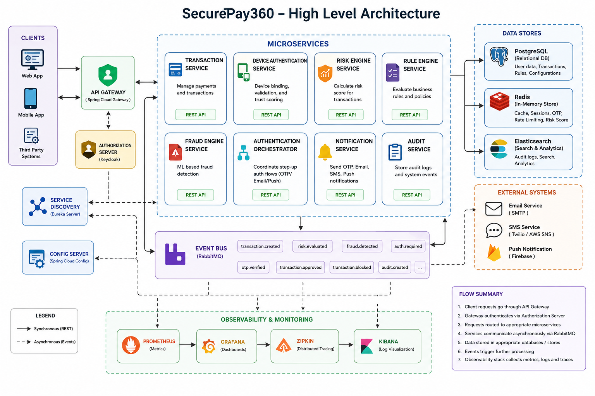

# SecurePay360

**SecurePay360** is a production-grade, event-driven payment security platform built as a Spring Boot microservices monorepo. It implements a full transaction lifecycle — from OAuth2-based authentication and device fingerprint validation through real-time risk scoring, rule evaluation, fraud detection, step-up OTP authentication, and immutable audit logging — all wired together over RabbitMQ with a centralized API Gateway entry point.



---

## Table of Contents

- [Features](#features)
- [Architecture Overview](#architecture-overview)
- [Tech Stack](#tech-stack)
- [Microservices & Port Map](#microservices--port-map)
- [Prerequisites](#prerequisites)
- [Project Structure](#project-structure)
- [Environment Variables](#environment-variables)
- [Local Development Setup](#local-development-setup)
  - [1. Start Infrastructure with Docker](#1-start-infrastructure-with-docker)
  - [2. Configure the Config Server](#2-configure-the-config-server)
  - [3. Build & Run Each Service](#3-build--run-each-service)
- [Docker — Full Stack Deployment](#docker--full-stack-deployment)
- [Build Commands](#build-commands)
- [Run Commands (per service)](#run-commands-per-service)
- [API Documentation](#api-documentation)
- [Observability & Monitoring](#observability--monitoring)
- [Database Setup](#database-setup)
- [RabbitMQ Message Bus](#rabbitmq-message-bus)
- [Troubleshooting](#troubleshooting)
- [Contributing](#contributing)
- [Repository Documentation](#repository-documentation)

---

## Features

- **OAuth2 / JWT Authentication** — Spring Authorization Server issuing signed JWTs; custom `/api/auth/login` and `/api/auth/register` endpoints backed by PostgreSQL.
- **Mutual TLS Device Authentication** — Device fingerprint validation with mTLS (PKCS12 keystores) and Redis-cached device sessions.
- **Event-Driven Transaction Processing** — Transactions published to RabbitMQ and consumed asynchronously by Risk Engine, Rule Engine, Fraud Engine, and Audit Service.
- **Outbox Pattern** — Reliable event publishing from Transaction Service using a transactional outbox table.
- **Real-Time Fraud Scoring** — Fraud Engine aggregates risk signals and emits `fraud.detected` events to the Auth Orchestrator.
- **Step-Up OTP Authentication** — Notification Service delivers SMS/email OTPs; Auth Orchestrator coordinates the challenge-response flow before approving or blocking a transaction.
- **Centralized Configuration** — Spring Cloud Config Server serving per-service YAML files from `config-repo/`; native filesystem profile for local development.
- **Service Discovery** — Netflix Eureka; all services register at startup and discover peers by logical name.
- **API Gateway** — Spring Cloud Gateway with JWT resource-server validation, Redis-backed rate limiting (per IP), and Resilience4j circuit breakers.
- **Distributed Tracing** — (Partially Configured) Zipkin infrastructure is present in Docker, but services lack required dependencies to export traces. `traceId` / `spanId` are propagated in logs via Micrometer.
- **Metrics & Dashboards** — Prometheus scrapes `/actuator/prometheus`; Grafana provides dashboards.
- **Immutable Audit Log** — Audit Service persists all domain events to Elasticsearch and is queryable via Kibana.
- **Database Migrations** — Authorization Server schema managed by Liquibase.

---

## Architecture Overview

```
                         Client (Web / Mobile / API)
                                    │
                                    ▼
                          ┌──────────────────┐
                          │   API Gateway    │  :8080
                          │ Spring Cloud GW  │
                          └────────┬─────────┘
                                   │  JWT validation (JWK from Auth Server)
               ┌───────────────────┴───────────────────┐
               ▼                                       ▼
  ┌─────────────────────┐                 ┌─────────────────────────┐
  │ Authorization Server│  :9000          │  Discovery / Config      │
  │ OAuth2 + JWT + Reg. │                 │  Eureka  :8761          │
  └──────────┬──────────┘                 │  Config  :8888          │
             │ (writes users to PostgreSQL)└─────────────────────────┘
             ▼
  ┌───────────────────────┐
  │  Device Auth Service  │  :8082  (mTLS)
  │  Fingerprint + Redis  │
  └──────────┬────────────┘
             ▼
  ┌───────────────────────┐
  │  Transaction Service  │  :8081
  │  PostgreSQL + Outbox  │
  └──────────┬────────────┘
             ▼
         RabbitMQ  :5672
             │
    ┌────────┼──────────┬──────────┐
    ▼        ▼          ▼          ▼
 Risk      Rule      Fraud      Audit
 Engine    Engine    Engine    Service
 :8083     :8084     :8085     :8088
    └────────┴──────────┘
             │  fraud.detected event
             ▼
  ┌─────────────────────────┐
  │  Auth Orchestrator      │  :8086
  │  OTP Challenge / Approve│
  └──────────┬──────────────┘
             │  challenge.completed.notification event
             ▼
  ┌─────────────────────────┐
  │  Notification Service   │  :8087
  │  SMS / Email OTP        │
  └─────────────────────────┘
             │  otp.verified event
             ▼
        Transaction Approved / Blocked
```

---

## Tech Stack

| Layer | Technology |
|---|---|
| Language | Java 17 |
| Framework | Spring Boot 3.4.3 |
| Cloud | Spring Cloud 2024.0.0 |
| API Gateway | Spring Cloud Gateway (WebFlux) |
| Security | Spring Security, Spring Authorization Server (OAuth2/JWT) |
| Service Discovery | Netflix Eureka |
| Configuration | Spring Cloud Config Server (native filesystem) |
| Messaging | RabbitMQ 3.12 via Spring AMQP |
| Persistence | PostgreSQL 16, Spring Data JPA |
| Caching | Redis 7.4 (Alpine) |
| Search / Audit | Elasticsearch 8.15.0, Spring Data Elasticsearch |
| Audit Visualization | Kibana 8.15.0 |
| Resilience | Resilience4j (Circuit Breaker, Rate Limiter) |
| Tracing | Micrometer Tracing (Zipkin partially configured but inactive) |
| Metrics | Micrometer + Prometheus + Grafana |
| Database Migrations | Liquibase (Authorization Server) |
| Build | Maven 3 (multi-module root POM + individual service POMs) |
| Containerization | Docker + Docker Compose |
| Code Generation | Lombok |

---

## Microservices & Port Map

| Service | Port | Description |
|---|---|---|
| `api-gateway` | **8080** | Single entry point; routes requests, validates JWTs, applies rate limits |
| `authorization-server` | **9000** | Issues OAuth2 JWTs; custom login/register REST endpoints |
| `discovery-service` | **8761** | Netflix Eureka server |
| `config-server` | **8888** | Spring Cloud Config Server (native filesystem) |
| `device-auth-service` | **8082** | Device fingerprint registration & mTLS challenge |
| `transaction-service` | **8081** | Creates transactions; publishes events via outbox pattern |
| `risk-engine-service` | **8083** | Computes initial risk score from transaction events |
| `rule-engine-service` | **8084** | Evaluates configurable business rules against risk scores |
| `fraud-engine-service` | **8085** | Aggregates signals and decides APPROVE / OTP / BLOCK |
| `auth-orchestrator-service` | **8086** | Orchestrates step-up OTP challenges |
| `notification-service` | **8087** | Delivers OTP via SMS / email |
| `audit-service` | **8088** | Persists all events to Elasticsearch |

### Supporting Infrastructure

| Service | Port | Description |
|---|---|---|
| PostgreSQL | 5432 | Primary relational database |
| Redis | 6379 | Caching, device sessions, rate-limiter store |
| RabbitMQ | 5672 / 15672 | Message broker / management UI |
| Elasticsearch | 9200 | Audit log storage |
| Kibana | 5601 | Audit log visualization |
| Zipkin | 9411 | Distributed trace UI (Currently inactive due to missing app dependencies) |
| Prometheus | 9090 | Metrics scraper |
| Grafana | 3000 | Metrics dashboards |

---

## Prerequisites

| Tool | Minimum Version |
|---|---|
| JDK | 17 |
| Maven | 3.8+ |
| Docker | 24+ |
| Docker Compose | v2 (plugin) |

> **Note:** All services use `mvnw` (Maven Wrapper) so a system-level Maven install is optional if you run per-service builds from within each service directory.

---

## Project Structure

```
SecurePay360/
├── pom.xml                         # Root aggregator POM (11 modules)
├── docker-compose.yml              # Full stack: infra + all services
├── prometheus.yml                  # Prometheus scrape targets
│
├── config-repo/                    # Spring Cloud Config source files
│   ├── application.yml             # Shared config (Eureka, RabbitMQ, tracing)
│   ├── api-gateway.yml
│   ├── authorization-server.yml
│   ├── transaction-service.yml
│   ├── device-auth-service.yml
│   ├── risk-engine-service.yml
│   ├── rule-engine-service.yml
│   ├── fraud-engine-service.yml
│   ├── auth-orchestrator-service.yml
│   ├── notification-service.yml
│   └── audit-service.yml
│
├── api-gateway/                    # Spring Cloud Gateway
├── authorization-server/           # OAuth2 Authorization Server + Liquibase
├── discovery-service/              # Eureka Server
├── config-server/                  # Spring Cloud Config Server
├── device-auth-service/            # Device fingerprint + mTLS
├── transaction-service/            # Transaction CRUD + outbox publisher
├── risk-engine-service/            # Risk scoring consumer
├── rule-engine-service/            # Rule evaluation consumer
├── fraud-engine-service/           # Fraud decision consumer
├── auth-orchestrator-service/      # OTP orchestration
├── notification-service/           # OTP delivery (SMS/email)
├── audit-service/                  # Elasticsearch audit log
└── shared/
    └── securepay-common/           # Shared DTOs / utilities
```

---

## Environment Variables

The following variables are referenced across service configurations. For local development, sensible defaults are already embedded in the YAML files.

| Variable | Default | Used By |
|---|---|---|
| `DATABASE_URL` | `jdbc:postgresql://localhost:5432/securepay` | authorization-server |
| `DATABASE_USERNAME` | `postgres` | authorization-server |
| `DATABASE_PASSWORD` | `postgres` | authorization-server |
| `EUREKA_URL` | `http://localhost:8761/eureka/` | all services |
| `RABBITMQ_HOST` | `localhost` | all services (via shared config) |
| `ZIPKIN_ENDPOINT` | `http://localhost:9411/api/v2/spans` | all services |
| `KEYSTORE_PASSWORD` | *(required for mTLS)* | device-auth-service |
| `TRUSTSTORE_PASSWORD` | *(required for mTLS)* | device-auth-service |
| `JWK_SET_URI` | `http://authorization-server:9000/oauth2/jwks` | api-gateway (Docker) |
| `SPRING_PROFILES_ACTIVE` | `default` | all services (Docker Compose) |

> **Local profile:** Append `--spring.profiles.active=local` when running services outside Docker to switch RabbitMQ, Redis, and PostgreSQL hosts to `localhost`.

---

## Local Development Setup

### 1. Start Infrastructure with Docker

Start only the infrastructure containers (databases, brokers, observability tools) without building application services:

```bash
docker compose up postgres redis rabbitmq elasticsearch kibana zipkin prometheus grafana -d
```

Wait for all health checks to pass before starting application services.

### 2. Configure the Config Server

The Config Server reads YAML files from the local filesystem path defined in `config-server/src/main/resources/application.yml`. By default it points to:

```
D:/Workspace/Spring Projects/SecurePay360/config-repo
```

**Update this path** to match your local checkout before running the Config Server:

```yaml
# config-server/src/main/resources/application.yml
spring:
  cloud:
    config:
      server:
        native:
          search-locations: file:///YOUR_ABSOLUTE_PATH/config-repo
```

### 3. Build & Run Each Service

Services must be started in the following order to satisfy health-check dependencies:

1. `discovery-service` (Eureka must be up first)
2. `config-server`
3. `authorization-server`
4. `api-gateway`
5. `device-auth-service`, `transaction-service` (can be started in parallel)
6. `risk-engine-service`, `rule-engine-service`, `fraud-engine-service`, `audit-service` (can be parallel)
7. `auth-orchestrator-service`
8. `notification-service`

**Build a single service:**

```bash
cd discovery-service
./mvnw clean package -DskipTests
```

**Run a single service (local profile):**

```bash
cd discovery-service
./mvnw spring-boot:run -Dspring-boot.run.profiles=local
```

Or run the built JAR:

```bash
java -jar target/*.jar --spring.profiles.active=local
```

---

## Docker — Full Stack Deployment

Build and start every service and all infrastructure in one command:

```bash
docker compose up --build -d
```

Docker Compose builds each service from its local `Dockerfile` using a two-stage Maven + JRE image. Services are wired together via the `securepay-network` bridge network.

**Check all running containers:**

```bash
docker compose ps
```

**Stream logs from a specific service:**

```bash
docker compose logs -f transaction-service
```

**Stop everything:**

```bash
docker compose down
```

**Stop and remove volumes (full reset):**

```bash
docker compose down -v
```

---

## Build Commands

### Build all modules from the root

```bash
./mvnw clean package -DskipTests
```

### Build a specific service

```bash
cd <service-directory>
./mvnw clean package -DskipTests
```

### Run tests for a specific service

```bash
cd <service-directory>
./mvnw test
```

### Run tests for all modules

```bash
./mvnw test
```

---

## Run Commands (per service)

| Service Directory | Command |
|---|---|
| `discovery-service/` | `./mvnw spring-boot:run` |
| `config-server/` | `./mvnw spring-boot:run` |
| `authorization-server/` | `./mvnw spring-boot:run` |
| `api-gateway/` | `./mvnw spring-boot:run` |
| `device-auth-service/` | `./mvnw spring-boot:run -Dspring-boot.run.profiles=local` |
| `transaction-service/` | `./mvnw spring-boot:run -Dspring-boot.run.profiles=local` |
| `risk-engine-service/` | `./mvnw spring-boot:run -Dspring-boot.run.profiles=local` |
| `rule-engine-service/` | `./mvnw spring-boot:run -Dspring-boot.run.profiles=local` |
| `fraud-engine-service/` | `./mvnw spring-boot:run -Dspring-boot.run.profiles=local` |
| `auth-orchestrator-service/` | `./mvnw spring-boot:run -Dspring-boot.run.profiles=local` |
| `notification-service/` | `./mvnw spring-boot:run -Dspring-boot.run.profiles=local` |
| `audit-service/` | `./mvnw spring-boot:run -Dspring-boot.run.profiles=local` |

---

## API Documentation

All client requests enter through the **API Gateway** on port `8080`.

### Authentication — `/api/auth/**`

Routed to `authorization-server` (port 9000).

#### Register a new user

```http
POST http://localhost:8080/api/auth/register
Content-Type: application/json

{
  "username": "alice",
  "password": "secret",
  "customerId": "CUST-001"
}
```

**Response:** `201 Created` — `"User registered successfully."`

#### Login and obtain JWT

```http
POST http://localhost:8080/api/auth/login
Content-Type: application/json

{
  "username": "alice",
  "password": "secret"
}
```

**Response:** `200 OK`

```json
{
  "accessToken": "<JWT>",
  "refreshToken": "<token>",
  "tokenType": "Bearer",
  "expiresIn": 3600,
  "scope": "openid read write"
}
```

#### OAuth2 / OIDC endpoints

```
GET  http://localhost:8080/oauth2/jwks          — JWK Set (public keys)
POST http://localhost:8080/oauth2/token         — Standard token endpoint
GET  http://localhost:9000/.well-known/openid-configuration
```

### Transactions — `/api/v1/transactions/**`

Requires a valid `Authorization: Bearer <JWT>` header (validated by the API Gateway).

#### Create a transaction

```http
POST http://localhost:8080/api/v1/transactions
Authorization: Bearer <JWT>
Content-Type: application/json

{
  "amount": 1500.00,
  "currency": "USD",
  "merchantId": "MERCH-42",
  "customerId": "CUST-001"
}
```

The transaction is persisted and an event is published to RabbitMQ, which triggers the full risk/fraud/orchestration pipeline asynchronously.

### Health Checks (Actuator)

Each service exposes `GET /actuator/health`. Examples:

```
GET http://localhost:8080/actuator/health   # API Gateway
GET http://localhost:9000/actuator/health   # Authorization Server
GET http://localhost:8081/actuator/health   # Transaction Service
GET http://localhost:8761/actuator/health   # Discovery Service
```

---

## Observability & Monitoring

| Tool | URL | Purpose |
|---|---|---|
| Eureka Dashboard | http://localhost:8761 | View all registered services |
| RabbitMQ Management | http://localhost:15672 | Queues, exchanges, messages (guest/guest) |
| Kibana | http://localhost:5601 | Audit log search and dashboards |
| Zipkin | http://localhost:9411 | Distributed trace explorer (Inactive) |
| Prometheus | http://localhost:9090 | Raw metrics and alert rules |
| Grafana | http://localhost:3000 | Metrics dashboards |

**Prometheus scrape targets** (from `prometheus.yml`):

```
api-gateway:8080, authorization-server:9000, device-auth-service:8082,
transaction-service:8081, risk-engine-service:8083, rule-engine-service:8084,
fraud-engine-service:8085, auth-orchestrator-service:8086,
notification-service:8087, audit-service:8088
```

All services expose metrics at `/actuator/prometheus`.

**Distributed tracing:** 100% sampling rate in development (`probability: 1.0`). **Note:** Zipkin is currently only partially configured. While the Docker Compose file includes a Zipkin service and the configuration repository sets the Zipkin endpoint, the active microservices lack the necessary `micrometer-tracing-bridge-brave` and `zipkin-reporter-brave` dependencies. As a result, no traces are currently exported to Zipkin. Log pattern includes `traceId` and `spanId` on every line.

---

## Database Setup

### PostgreSQL

A single `securepay` database is shared by all services that require persistence.

**Docker Compose provisions it automatically:**

```yaml
POSTGRES_DB: securepay
POSTGRES_USER: postgres
POSTGRES_PASSWORD: postgres
```

For local development, create the database manually:

```sql
CREATE DATABASE securepay;
```

### Schema Management

- **Authorization Server** — schema is managed by **Liquibase** (`db/changelog/db.changelog-master.yml`). Runs automatically on startup.
- **Other services** — Spring Boot `spring.jpa.hibernate.ddl-auto` handles schema creation/validation per service.

### Redis

Redis is used for:
- API Gateway rate limiting (per-IP key resolver)
- Device session caching (`device-auth-service`)
- Transaction caching (`transaction-service`)
- OTP/step-up state (`risk-engine-service`, `fraud-engine-service`, `auth-orchestrator-service`)

Default connection: `localhost:6379` (no password in development).

### Elasticsearch

Used exclusively by the **Audit Service** for append-only event storage.

Default URI: `http://localhost:9200`  
Security is disabled (`xpack.security.enabled: false`) in the Docker Compose configuration.

---

## RabbitMQ Message Bus

All services communicate asynchronously through a **Topic Exchange** named `securepay.exchange`.

| Routing Key | Queue | Publisher → Consumer |
|---|---|---|
| `transaction.created` | *(bound by downstream services)* | Transaction Service → Risk / Rule / Fraud / Audit |
| `fraud.detected` | `auth.fraud.detected.q` | Fraud Engine → Auth Orchestrator |
| `otp.verified` | `auth.otp.verified.q` | Notification Service → Auth Orchestrator |
| `auth.challenge.completed.notification` | `auth.challenge.completed.notification.q` | Auth Orchestrator → Notification Service |

RabbitMQ connection defaults: `guest` / `guest` on `localhost:5672`.

---

## Troubleshooting

### Services fail to start — "Connection refused" to Config Server

Ensure the **Config Server** (port 8888) is running and healthy before starting any business service. All services bootstrap their configuration from it.

```bash
curl http://localhost:8888/actuator/health
```

### "Config Server not located" / "connection refused to localhost:8888"

Verify the `search-locations` path in `config-server/src/main/resources/application.yml` is an absolute path that actually exists on disk.

### Eureka shows services as DOWN

Services register with Eureka but heartbeats may take 30–90 seconds to stabilize. Wait and refresh the Eureka dashboard at http://localhost:8761.

### RabbitMQ messages not being consumed

1. Check that the consumer service is running and registered with Eureka.
2. Verify queue bindings in the RabbitMQ management UI at http://localhost:15672.
3. Look for `ConditionalOnProperty` guards or missing queue definitions in the service's `RabbitMQConfig`.

### Device Auth Service fails to start (mTLS)

Device auth requires PKCS12 keystores. Ensure `KEYSTORE_PASSWORD` and `TRUSTSTORE_PASSWORD` environment variables are set and the keystore files exist at `classpath:certs/device-auth-service.p12` and `classpath:certs/truststore.p12`.

### Docker builds fail (Maven dependency download errors)

Run with a warm Maven cache by mounting `~/.m2` as a Docker volume, or pre-build the JARs locally and copy them:

```bash
# Pre-build all JARs locally
./mvnw clean package -DskipTests

# Then Docker Compose will reuse the target/*.jar via COPY
docker compose up --build -d
```

### Port conflicts

If any default port is already in use, override it by editing the relevant port mapping in `docker-compose.yml` before starting.

---

## Contributing

1. **Fork** this repository and create a feature branch from `main`.
2. Keep each microservice self-contained — avoid cross-module compile-time dependencies (use messaging events instead).
3. Add or update unit tests for any changed business logic. Run tests with `./mvnw test` from the affected service directory.
4. Ensure all service health endpoints (`/actuator/health`) return `UP` before submitting a pull request.
5. Follow the existing package structure: `com.securepay.<service-name>.<layer>`.
6. Read the [Code of Conduct](./CODE_OF_CONDUCT.md) and [Security Policy](./SECURITY.md) before contributing.

---

## Repository Documentation

### Core Infrastructure

| Component | Documentation |
|---|---|
| API Gateway | [README](./api-gateway/README.md) |
| Authorization Server | [README](./authorization-server/README.md) |
| Discovery Service | [README](./discovery-service/README.md) |
| Config Server | [README](./config-server/README.md) |

### Business Services

| Service | Documentation |
|---|---|
| Auth Orchestrator Service | [README](./auth-orchestrator-service/README.md) |
| Device Authentication Service | [README](./device-auth-service/README.md) |
| Risk Engine Service | [README](./risk-engine-service/README.md) |
| Rule Engine Service | [README](./rule-engine-service/README.md) |
| Fraud Engine Service | [README](./fraud-engine-service/README.md) |
| Notification Service | [README](./notification-service/README.md) |
| Audit Service | [README](./audit-service/README.md) |

### Project-Level Documentation

- [Code of Conduct](./CODE_OF_CONDUCT.md)
- [Security Policy](./SECURITY.md)
