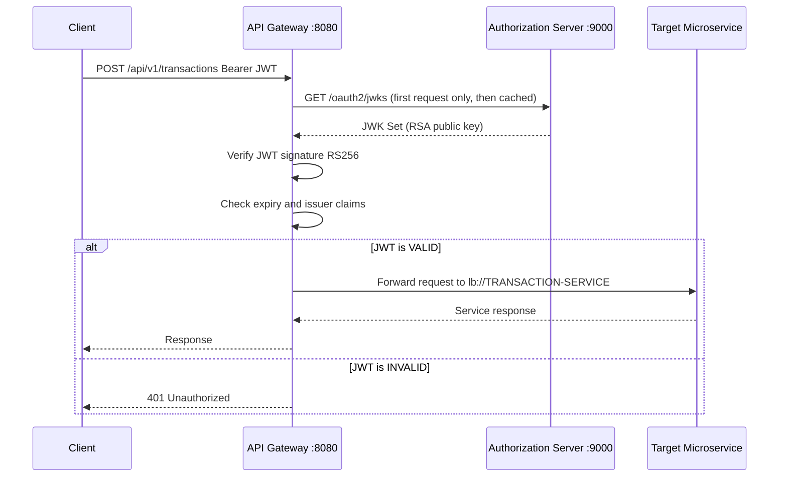

# API Gateway

> **The single entry point for all external traffic** - handles JWT validation, request routing, load balancing, and cross-cutting concerns.

---

## Overview

The **API Gateway** is built on **Spring Cloud Gateway** and serves as the only publicly exposed service (port 8080) in the FraudShield platform. It validates JWT tokens against the Authorization Server's public key, routes requests to downstream services via Eureka service discovery, and applies cross-cutting filters.

---

## Responsibilities

- Validate JWT bearer tokens on every protected request
- Route requests to the appropriate microservice using Eureka load balancing
- Apply response header deduplication to prevent CORS header duplication
- Expose platform health and route information via Actuator
- Relay JWKS requests to the Authorization Server for token verification setup

---

## Tech Stack

| Component | Technology |
|---|---|
| Framework | Spring Boot 3 |
| Gateway | Spring Cloud Gateway |
| Security | Spring Security OAuth2 Resource Server |
| Discovery | Spring Cloud Netflix Eureka Client |
| Config | Spring Cloud Config Client |

---

## Port

`8080` (publicly exposed - the only public entry point)

---

## Folder Structure

```
api-gateway/
├── Dockerfile
├── pom.xml
└── src/main/
    ├── java/com/fraudshield/gateway/
    │   └── ApiGatewayApplication.java
    └── resources/
        └── application.yml          # All routes and security configuration
```

The API Gateway is mostly configuration-driven with minimal custom Java code.

---

## Route Configuration

All routes are defined in `application.yml`:

### Public Routes (No JWT Required)

| Route ID | Method | Path | Upstream |
|---|---|---|---|
| `auth-server-login` | POST | `/api/auth/register` | `lb://AUTHORIZATION-SERVER` |
| `auth-server-login` | POST | `/api/auth/login` | `lb://AUTHORIZATION-SERVER` |
| `authorization-server` | ANY | `/oauth2/**` | `lb://AUTHORIZATION-SERVER` |

### Protected Routes (JWT Required)

| Route ID | Path | Upstream Service |
|---|---|---|
| `transaction-service` | `/api/v1/transactions/**` | `lb://TRANSACTION-SERVICE` |
| `device-auth-service` | `/api/v1/devices/**` | `lb://DEVICE-AUTH-SERVICE` |
| `risk-engine-service` | `/api/v1/risk/**` | `lb://RISK-ENGINE-SERVICE` |
| `rule-engine-service` | `/api/v1/rules/**` | `lb://RULE-ENGINE-SERVICE` |
| `fraud-engine-service` | `/api/v1/fraud/**` | `lb://FRAUD-ENGINE-SERVICE` |
| `auth-orchestrator-service` | `/api/v1/auth/**` | `lb://AUTH-ORCHESTRATOR-SERVICE` |
| `notification-service` | `/api/v1/notifications/**` | `lb://NOTIFICATION-SERVICE` |
| `audit-service` | `/api/v1/audit/**` | `lb://AUDIT-SERVICE` |

---

## JWT Validation

The API Gateway is configured as an OAuth2 Resource Server:

```yaml
spring:
  security:
    oauth2:
      resourceserver:
        jwt:
          jwk-set-uri: ${JWK_SET_URI:http://authorization-server:9000/oauth2/jwks}
```

Validation process:

```
Incoming Request with Authorization: Bearer JWT
          |
Spring Security OAuth2 Resource Server filter
          |
1. Fetch public key from /oauth2/jwks (cached after first fetch)
          |
2. Verify JWT signature using RS256 and RSA public key
          |
3. Check token expiry (exp claim)
          |
4. Check issuer (iss claim)
          |
PASS: Route request to upstream service
FAIL: Return 401 Unauthorized
```

---

## Filters Applied

| Filter | Purpose |
|---|---|
| `DedupeResponseHeader` | Removes duplicate `Access-Control-Allow-Credentials` and `Access-Control-Allow-Origin` headers |
| `RewritePath` | Path transformation where needed |

---

## Actuator Endpoints

```
GET /actuator/health          # Gateway health status
GET /actuator/gateway/routes  # All configured routes
GET /actuator/prometheus      # Prometheus metrics
```

---

## Configuration

```yaml
server:
  port: 8080

spring:
  application:
    name: api-gateway

  cloud:
    gateway:
      discovery:
        locator:
          enabled: true      # Dynamic service discovery
      default-filters:
        - DedupeResponseHeader=Access-Control-Allow-Credentials Access-Control-Allow-Origin

  security:
    oauth2:
      resourceserver:
        jwt:
          jwk-set-uri: ${JWK_SET_URI:http://authorization-server:9000/oauth2/jwks}

eureka:
  client:
    service-url:
      defaultZone: ${EUREKA_URL:http://localhost:8761/eureka/}
```

---

## Request Flow Through Gateway



---

## Error Responses

| HTTP Status | Scenario |
|---|---|
| 401 Unauthorized | Missing JWT or invalid signature |
| 403 Forbidden | Valid JWT but insufficient scope |
| 404 Not Found | No route matches the request path |
| 503 Service Unavailable | Upstream service is down or unregistered |

---

## Local Development

```bash
docker-compose up -d postgres redis rabbitmq
cd discovery-service && mvn spring-boot:run  # Wait for port 8761
cd config-server && mvn spring-boot:run      # Wait for port 8888
cd authorization-server && mvn spring-boot:run
cd api-gateway && mvn spring-boot:run
```

Test routing:
```bash
# Get token first
TOKEN=$(curl -s -X POST http://localhost:8080/api/auth/login \
  -H "Content-Type: application/json" \
  -d '{"username":"test","password":"Test123"}' | jq -r .accessToken)

# Test protected route
curl -H "Authorization: Bearer $TOKEN" http://localhost:8080/api/v1/rules

# View all routes
curl http://localhost:8080/actuator/gateway/routes
```

Health check: `GET http://localhost:8080/actuator/health`
