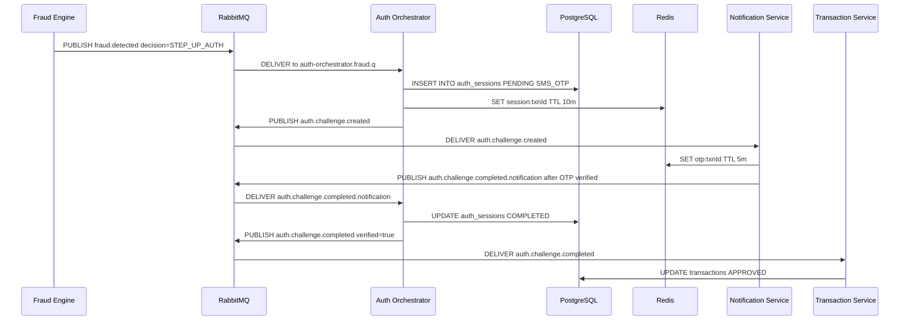

# Auth Orchestrator Service

> **Acts as the authentication state machine** - routing fraud decisions to either auto-approval, step-up OTP authentication, or transaction blocking.

---

## Overview

The **Auth Orchestrator Service** is the central coordinator in the post-fraud-decision phase. It consumes `fraud.detected` events and, based on the decision, either approves the transaction immediately, initiates a multi-factor authentication (MFA) challenge, or blocks the transaction. It also consumes OTP verification results to finalize MFA flows.

---

## Responsibilities

- Consume `fraud.detected` events and act on the decision
- For `APPROVE`: immediately publish `auth.challenge.completed` event
- For `STEP_UP_AUTH` or `HIGH_RISK`: create an `AuthSession`, cache it in Redis, publish `auth.challenge.created`
- For `BLOCK`: publish `transaction.blocked` event
- Consume `auth.challenge.completed.notification` events from OTP verification results
- Update `AuthSession` status and publish finalization events
- Persist all auth sessions to PostgreSQL for auditability

---

## Tech Stack

| Component | Technology |
|---|---|
| Framework | Spring Boot 3 |
| Messaging | Spring AMQP / RabbitMQ |
| Database | Spring Data JPA + PostgreSQL |
| Cache | Spring Data Redis (auth session cache) |
| Service Discovery | Spring Cloud Eureka Client |
| Utilities | Lombok |

---

## Port

`8086` (internal only)

---

## Folder Structure

```
auth-orchestrator-service/
├── Dockerfile
├── pom.xml
└── src/main/java/com/securepay/auth/
    ├── AuthOrchestratorServiceApplication.java
    ├── config/
    │   └── RabbitMQConfig.java       # All queue and exchange declarations
    ├── consumer/
    │   ├── FraudConsumer.java         # Listens: fraud.detected
    │   ├── OtpVerifiedConsumer.java   # Listens: otp.verified (legacy)
    │   └── AuthChallengeCompletedConsumer.java  # Listens: auth.challenge.completed.notification
    ├── service/
    │   └── AuthOrchestratorService.java  # Core state machine logic
    ├── entity/
    │   └── AuthSession.java
    ├── repository/
    │   └── AuthSessionRepository.java
    └── event/
        ├── FraudDetectedEvent.java
        ├── AuthChallengeCreatedEvent.java
        ├── AuthChallengeCompletedEvent.java
        ├── OtpVerifiedEvent.java
        └── AuthChallengeCompletedEvent.java
```

---

## RabbitMQ

### Consumed Events

| Queue | Routing Key | Consumer | Action |
|---|---|---|---|
| `auth-orchestrator.fraud.q` | `fraud.detected` | FraudConsumer | Route based on decision |
| `auth-orchestrator.otp.verified.q` | `otp.verified` | OtpVerifiedConsumer | Verify challenge result |
| `auth-orchestrator.challenge.completed.notif.q` | `auth.challenge.completed.notification` | AuthChallengeCompletedConsumer | Handle OTP verification result |

### Published Events

| Routing Key | Trigger | Payload |
|---|---|---|
| `auth.challenge.created` | STEP_UP_AUTH or HIGH_RISK decision | `{transactionId, customerId, authType}` |
| `auth.challenge.completed` | APPROVE or OTP verified | `{transactionId, verified}` |
| `transaction.blocked` | BLOCK decision or MFA failure | `{transactionId, reason}` |

---

## Database

### Table: `auth_sessions`

| Column | Type | Description |
|---|---|---|
| `id` | UUID PK | Auto-generated UUID |
| `transaction_id` | UUID | Related transaction |
| `customer_id` | UUID | Customer identifier |
| `auth_type` | VARCHAR | SMS_OTP or SMS_EMAIL_OTP |
| `status` | VARCHAR | PENDING, COMPLETED, or FAILED |
| `created_at` | TIMESTAMP | Session creation timestamp |

---

## Redis

| Key Pattern | Type | TTL | Purpose |
|---|---|---|---|
| `session:{transactionId}` | String | 10 minutes | Auth session type cache for quick lookup |

---

## Decision Matrix

```
FraudDetectedEvent.decision = ?

APPROVE:
  -> AuthOrchestratorService.publishCompletion(txnId, verified=true)
  -> PUBLISH auth.challenge.completed
  -> TransactionService: UPDATE status=APPROVED

STEP_UP_AUTH:
  -> AuthType = SMS_OTP
  -> INSERT INTO auth_sessions {txnId, PENDING, SMS_OTP}
  -> SET session:{txnId} = SMS_OTP TTL 10m
  -> PUBLISH auth.challenge.created
  -> NotificationService sends OTP via SMS

HIGH_RISK:
  -> AuthType = SMS_EMAIL_OTP
  -> INSERT INTO auth_sessions {txnId, PENDING, SMS_EMAIL_OTP}
  -> SET session:{txnId} = SMS_EMAIL_OTP TTL 10m
  -> PUBLISH auth.challenge.created
  -> NotificationService sends OTP via SMS and Email

BLOCK:
  -> PUBLISH transaction.blocked {txnId, reason="Fraud score exceeds threshold"}
  -> TransactionService: UPDATE status=BLOCK
```

---

## OTP Completion Flow

When the Notification Service processes OTP verification, it publishes `auth.challenge.completed.notification`:

```
auth.challenge.completed.notification consumed
          |
AuthChallengeCompletedConsumer.consume(event)
          |
AuthOrchestratorService.handleChallengeCompletion(txnId, status)
          |
if status == COMPLETED:
  UPDATE auth_sessions SET status=COMPLETED
  PUBLISH auth.challenge.completed {transactionId, verified=true}
  -> Transaction Service updates status=APPROVED

if status == FAILED:
  UPDATE auth_sessions SET status=FAILED
  PUBLISH transaction.blocked {transactionId, reason="MFA failed"}
  -> Transaction Service updates status=BLOCK
```

---

## Internal Request Flow



---

## Configuration

```yaml
server:
  port: 8086

spring:
  application:
    name: auth-orchestrator-service
  datasource:
    url: ${DATABASE_URL:jdbc:postgresql://localhost:5432/securepay}
    username: ${DATABASE_USERNAME:postgres}
    password: ${DATABASE_PASSWORD:postgres}
  rabbitmq:
    host: ${RABBITMQ_HOST:localhost}
    port: ${RABBITMQ_PORT:5672}
  data:
    redis:
      host: ${REDIS_HOST:localhost}
      port: ${REDIS_PORT:6379}
```

---

## Error Handling

| Scenario | Behavior |
|---|---|
| Unknown fraud decision | Exception logged, message NACKed |
| Redis write failure | NACK, message retried |
| Database write failure | NACK, message retried |

---

## Local Development

```bash
docker-compose up -d postgres redis rabbitmq
cd discovery-service && mvn spring-boot:run
cd config-server && mvn spring-boot:run
cd auth-orchestrator-service && mvn spring-boot:run
```

Health check: `GET http://localhost:8086/actuator/health`
