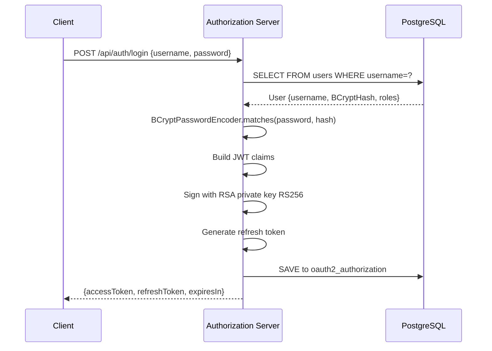

# Authorization Server

> **OAuth2 Authorization Server** - issues JWTs, manages user registration and login, and provides public key material for JWT verification.

---

## Overview

The **Authorization Server** is the identity backbone of FraudShield. Built on **Spring Authorization Server**, it manages user accounts, handles authentication, issues RS256-signed JWTs, and exposes JWKS (JSON Web Key Set) endpoints so downstream services (especially the API Gateway) can verify tokens without calling back to this service on every request.

---

## Responsibilities

- User registration: hash passwords with BCrypt and store in PostgreSQL
- User authentication: validate credentials and issue JWT access tokens
- JWT issuance: RS256 signed tokens with configurable expiry
- Refresh token management: issue and validate refresh tokens
- JWKS endpoint: expose public key for JWT signature verification
- OAuth2 authorization code flow support
- OAuth2 client credentials grant support

---

## Tech Stack

| Component | Technology |
|---|---|
| Framework | Spring Boot 3 |
| Auth | Spring Authorization Server 1.x |
| Security | Spring Security |
| Database | Spring Data JPA + PostgreSQL |
| Schema | Liquibase migration |
| Utilities | Lombok |

---

## Port

`9000` (exposed publicly for token issuance and JWKS)

---

## Folder Structure

```
authorization-server/
├── Dockerfile
├── pom.xml
└── src/main/
    ├── java/com/fraudshield/auth/
    │   ├── AuthorizationServerApplication.java
    │   ├── config/
    │   │   ├── AuthorizationServerConfig.java  # Spring Auth Server configuration
    │   │   └── SecurityConfig.java             # HTTP security rules
    │   ├── controller/
    │   │   └── AuthController.java             # /api/auth/register and /api/auth/login
    │   ├── service/
    │   │   └── UserDetailsServiceImpl.java      # Loads user from DB
    │   ├── entity/
    │   │   └── User.java                        # users table
    │   └── repository/
    │       └── UserRepository.java
    └── resources/
        ├── application.yml
        └── db/changelog/
            └── db.changelog-master.yml          # Liquibase schema
```

---

## REST API

### Register User

```http
POST /api/auth/register
Content-Type: application/json

{
  "username": "john.doe",
  "password": "SecurePassword123",
  "customerId": "CUS-001"
}
```

**Response 201 Created:**
```json
{
  "message": "User registered successfully"
}
```

### Login and Get JWT

```http
POST /api/auth/login
Content-Type: application/json

{
  "username": "john.doe",
  "password": "SecurePassword123"
}
```

**Response 200 OK:**
```json
{
  "accessToken": "eyJhbGciOiJSUzI1NiJ9...",
  "refreshToken": "xxx",
  "tokenType": "Bearer",
  "expiresIn": 3599
}
```

### Get Public Key (JWKS)

```http
GET /oauth2/jwks
```

**Response 200 OK:**
```json
{
  "keys": [{
    "kty": "RSA",
    "kid": "fraudshield-key",
    "use": "sig",
    "alg": "RS256",
    "n": "...",
    "e": "AQAB"
  }]
}
```

The API Gateway fetches this endpoint once and caches the public key to validate JWTs locally.

---

## Database Schema (via Liquibase)

### Table: `users`

| Column | Type | Description |
|---|---|---|
| `id` | UUID PK | Auto-generated UUID |
| `username` | VARCHAR UNIQUE | Login username |
| `password` | VARCHAR | BCrypt hashed password |
| `customer_id` | VARCHAR | Associated customer ID |
| `enabled` | BOOLEAN | Account enabled flag |
| `roles` | VARCHAR | Comma-separated roles |
| `created_at` | TIMESTAMP | Registration timestamp |

### Standard Spring Auth Server Tables

- `oauth2_registered_client` - OAuth2 client configurations
- `oauth2_authorization` - Active authorization records (tokens, codes)
- `oauth2_authorization_consent` - User consent records

Schema is managed by Liquibase from `db/changelog/db.changelog-master.yml`.

---

## JWT Token Structure

```json
{
  "header": {
    "alg": "RS256",
    "kid": "fraudshield-key"
  },
  "payload": {
    "sub": "john.doe",
    "iat": 1719748800,
    "exp": 1719752400,
    "iss": "http://authorization-server:9000",
    "aud": "fraudshield-client",
    "scope": "read write"
  }
}
```

---

## Authentication Flow



---

## Configuration

```yaml
server:
  port: 9000

spring:
  application:
    name: authorization-server
  datasource:
    url: ${DATABASE_URL:jdbc:postgresql://localhost:5432/fraudshield}
    username: ${DATABASE_USERNAME:postgres}
    password: ${DATABASE_PASSWORD:postgres}
  jpa:
    hibernate:
      ddl-auto: validate
  liquibase:
    change-log: classpath:db/changelog/db.changelog-master.yml
    enabled: true
  flyway:
    enabled: false

eureka:
  client:
    service-url:
      defaultZone: ${EUREKA_URL:http://localhost:8761/eureka/}
```

---

## Security Notes

| Aspect | Implementation |
|---|---|
| Password storage | BCrypt strength 10 |
| Token algorithm | RS256 with RSA 2048-bit key pair |
| Token expiry | 1 hour for access tokens |
| Refresh token | Rotated on each use |
| Key rotation | Supported via kid header |

---

## Error Handling

| HTTP Status | Scenario |
|---|---|
| 201 Created | User registered successfully |
| 400 Bad Request | Username already exists or invalid input |
| 401 Unauthorized | Invalid credentials |
| 500 Internal Server Error | Database error |

---

## Local Development

```bash
docker-compose up -d postgres
cd discovery-service && mvn spring-boot:run
cd authorization-server && mvn spring-boot:run
```

Health check: `GET http://localhost:9000/actuator/health`

Test registration and login:
```bash
curl -X POST http://localhost:9000/api/auth/register \
  -H "Content-Type: application/json" \
  -d '{"username":"test","password":"Test123","customerId":"CUS001"}'

curl -X POST http://localhost:9000/api/auth/login \
  -H "Content-Type: application/json" \
  -d '{"username":"test","password":"Test123"}'
```
