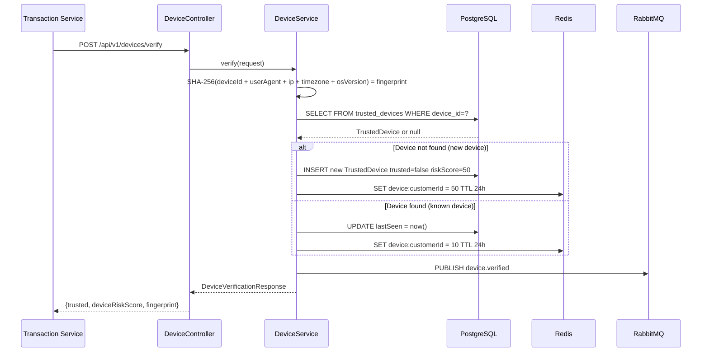

# Device Auth Service

> **Manages device identity and trust** - fingerprinting, verification, and risk scoring for every device that initiates a transaction.

---

## Overview

The **Device Auth Service** is the first line of defense in the SecurePay360 fraud detection pipeline. It receives device metadata, generates a SHA-256 fingerprint, performs a database lookup to determine device trust, caches the result in Redis, and publishes a `device.verified` event.

It is called **synchronously** by the Transaction Service before any fraud assessment begins.

---

## Responsibilities

- Receive device metadata from Transaction Service via REST
- Generate a deterministic SHA-256 fingerprint from device attributes
- Look up or register the device in the `trusted_devices` PostgreSQL table
- Assign a risk score based on whether the device is known or new
- Cache device risk score in Redis (TTL 24 hours) for use by the Risk Engine
- Publish `device.verified` event to RabbitMQ
- Return trust status and risk score to the caller

---

## Tech Stack

| Component | Technology |
|---|---|
| Framework | Spring Boot 3 |
| REST API | Spring Web MVC |
| Database | Spring Data JPA + PostgreSQL |
| Cache | Spring Data Redis |
| Messaging | Spring AMQP / RabbitMQ |
| Service Discovery | Spring Cloud Eureka Client |
| Utilities | Lombok |

---

## Port

`8082` (internal only, not exposed via API Gateway directly for transactions)

---

## Folder Structure

```
device-auth-service/
├── Dockerfile
├── pom.xml
└── src/main/java/com/securepay/device/
    ├── DeviceAuthServiceApplication.java
    ├── config/
    │   └── RabbitMQConfig.java
    ├── controller/
    │   └── DeviceController.java      # POST /api/v1/devices/verify
    ├── service/
    │   └── DeviceService.java         # Core fingerprinting and trust logic
    ├── entity/
    │   └── TrustedDevice.java         # JPA entity - trusted_devices table
    ├── repository/
    │   └── TrustedDeviceRepository.java
    ├── dto/
    │   ├── DeviceVerificationRequest.java
    │   └── DeviceVerificationResponse.java
    └── event/
        └── DeviceVerifiedEvent.java
```

---

## REST API

### Verify Device

```http
POST /api/v1/devices/verify
Authorization: Bearer {JWT}
Content-Type: application/json

{
  "deviceId": "a1b2c3d4-e5f6-7890-abcd-1234567890ab",
  "customerId": "f47ac10b-58cc-4372-a567-0e02b2c3d479",
  "userAgent": "Mozilla/5.0 (Windows NT 10.0; Win64; x64)",
  "ipAddress": "192.168.1.100",
  "timezone": "Asia/Kolkata",
  "osVersion": "Windows 10"
}
```

**Response 200 OK:**
```json
{
  "trusted": false,
  "deviceRiskScore": 50,
  "fingerprint": "3a4f9c2b1d8e7f6a5b9c3d2e1f..."
}
```

---

## RabbitMQ

### Published Events

| Routing Key | Trigger | Payload |
|---|---|---|
| `device.verified` | After successful device verification | `{deviceId, customerId, trusted, riskScore, fingerprint}` |

---

## Database

### Table: `trusted_devices`

| Column | Type | Description |
|---|---|---|
| `device_id` | UUID PK | Device identifier from client |
| `customer_id` | UUID | Owner customer |
| `fingerprint` | VARCHAR | SHA-256 hash of device attributes |
| `risk_score` | INT | Assigned risk score 10 for trusted, 50 for new |
| `trusted` | BOOLEAN | Whether device is known and trusted |
| `created_at` | TIMESTAMP | First seen timestamp |
| `last_seen` | TIMESTAMP | Most recent verification timestamp |

---

## Redis

| Key Pattern | Type | TTL | Value |
|---|---|---|---|
| `device:{customerId}` | String Integer | 24 hours | Device risk score integer |

The Risk Engine reads this key to obtain the device risk score without needing to call Device Auth Service again.

---

## Internal Request Flow



---

## Configuration

```yaml
server:
  port: 8082

spring:
  application:
    name: device-auth-service
  datasource:
    url: ${DATABASE_URL:jdbc:postgresql://localhost:5432/securepay}
    username: ${DATABASE_USERNAME:postgres}
    password: ${DATABASE_PASSWORD:postgres}
  data:
    redis:
      host: ${REDIS_HOST:localhost}
      port: ${REDIS_PORT:6379}
  rabbitmq:
    host: ${RABBITMQ_HOST:localhost}
    port: ${RABBITMQ_PORT:5672}
```

---

## Error Handling

| HTTP Status | Scenario |
|---|---|
| 400 Bad Request | Missing or invalid device attributes |
| 401 Unauthorized | Missing or invalid JWT |
| 500 Internal Server Error | Database or Redis connection failure |

---

## Local Development

```bash
docker-compose up -d postgres redis rabbitmq
cd discovery-service && mvn spring-boot:run
cd config-server && mvn spring-boot:run
cd device-auth-service && mvn spring-boot:run
```

Health check: `GET http://localhost:8082/actuator/health`
